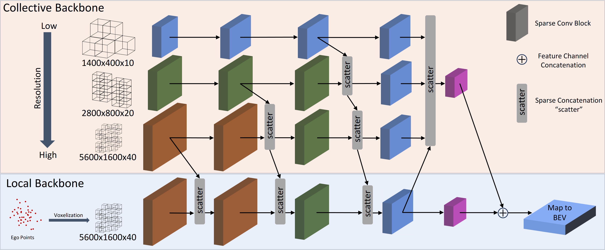

## MR3D-Net: Dynamic Multi-Resolution 3D Sparse Voxel Grid Fusion for LiDAR-Based Collective Perception

**by Sven Teufel, Jörg Gamerdinger, Georg Volk, and Oliver Bringmann**

## Overview
This repository contains the official code for the **ITSC 2024** paper [MR3D-Net: Dynamic Multi-Resolution 3D Sparse Voxel Grid Fusion for LiDAR-Based Collective Perception](todo).
MR3D-Net is a multi-resolution sparse voxel grid fusion architecture for LiDAR-based collective perception. MR3D-Net achieves state-of-the-art results on the OPV2V Benchmark while reducing the required bandwidth by up to 94%. 
As an environment representation MR3D-Net soley relies on sparse voxel grids at different resolutions that can be dynamically assigned to adapt to the limitations in wireless communication.
Sparse voxel grids can not only drastically reduce the required bandwidth, but also provide a unified and interchangable representation of the environment.



## Getting Started

### Requirements

This code was tested on Linux with
* Python 3.11
* PyTorch 2.1.2
* CUDA 11.8

### Installation

Create a virtual environment 
```shell
python3.11 -m venv mr3d_net
```
and activate it by running
```shell
source mr3d_net/bin/activate
```

clone this repository 
```shell
git clone https://github.com/ekut-es/MR3D-Net.git
cd MR3D-Net
```

Install dependecies by running
```shell
pip install torch==2.1.2 torchvision==0.16.2 torchaudio==2.1.2 --index-url https://download.pytorch.org/whl/cu118
pip install torch-scatter -f https://data.pyg.org/whl/torch-2.1.2+cu118.html
pip install spconv-cu118
pip install -r requirements.txt
```


Install this repository by running 
```shell
python setup.py develop
```

In case CUDA is not found set CUDA_HOME before running setup.py
```shell
export CUDA_HOME=/usr/local/cuda-11.8
```

## Data Preparation
Download OPV2V and organize it as follows:
```
MR3D-Net
├── data
│   ├── OPV2V
│   │   │── train
│   │   │── validate
│   │   │── test
```

Generate the dataset infos by running
```shell
python pcdet/datasets/opv2v/openv2v_dataset.py
```

## Training

MR3D-Net can be configured in: /tools/cfgs/opv2v_models/mr3d-net.yaml

The voxel grid resolutions as well as the assignment method can be configured in: /tools/cfgs/dataset_configs/opv2v_dataset.yaml

To train MR3D-Net run
```shell
cd tools
python train_mr3d_net.py --extra_tag "name of experiment"
```

## Testing

To test MR3D-Net run 
```shell
python test.py --ckpt "path to checkpoint"
```
For more details on training and testing configuration please have a look at train.py and test.py


### MR3D-Net Results on OPV2V
|                                    | Car AP@IoU0.7 | Bandwidth@10Hz [Mbit/s] | Model Checkpoint |
| :--------------------------------: | :-----------: | :---------------------: | 
| No Fusion                          | 76.7          | -                       | [`download`](https://es-cloud.cs.uni-tuebingen.de/f/9ea529e129ad48de8f5d/)
| Low Resolution                     | 82.1          | 4.3                     | [`download`](https://es-cloud.cs.uni-tuebingen.de/f/24badeb37fe34276b5e3/)
| Medium Resolution                  | 83.2          | 8.8                     | [`download`](https://es-cloud.cs.uni-tuebingen.de/f/46a3b9305db94983960a/)
| High Resolution                    | 83.9          | 14.4                    | [`download`](https://es-cloud.cs.uni-tuebingen.de/f/ccc8cb6a24f442df9c05/)
| Dynamic Resolution                 | 82.4          | 9.2                     | [`download`](https://es-cloud.cs.uni-tuebingen.de/f/c31c56a649a7476f87af/)
| Mean Features (Dynamic Resolution) | 81.7          | 42.2                    | [`download`](https://es-cloud.cs.uni-tuebingen.de/f/6bc916642f10494da3ef/)

## Citation
If you find this project useful in your research, please consider citing:
```
@misc{teufel2024mr3dnet,
      title={MR3D-Net: Dynamic Multi-Resolution 3D Sparse Voxel Grid Fusion for LiDAR-Based Collective Perception}, 
      author={Sven Teufel and Jörg Gamerdinger and Georg Volk and Oliver Bringmann},
      year={2024},
      eprint={2408.06137},
      archivePrefix={arXiv},
      primaryClass={cs.CV},
      url={https://arxiv.org/abs/2408.06137}, 
}
```

### OpenPCDet

This project is basen upon [`OpenPCDet`](https://github.com/open-mmlab/OpenPCDet)  
If you find this project useful, please consider also citing:
```
@misc{openpcdet2020,
    title={OpenPCDet: An Open-source Toolbox for 3D Object Detection from Point Clouds},
    author={OpenPCDet Development Team},
    howpublished = {\url{https://github.com/open-mmlab/OpenPCDet}},
    year={2020}
}
```


